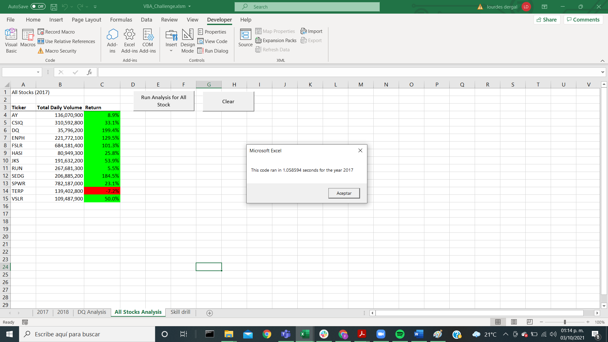
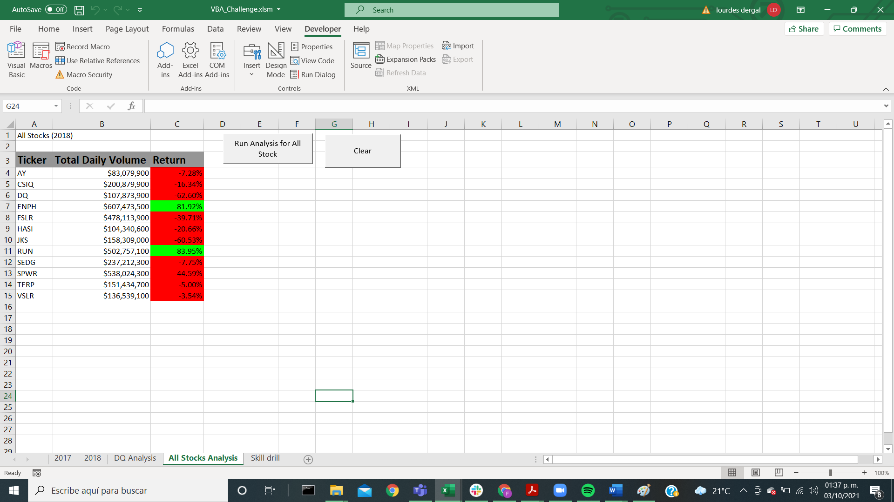

# stock-analysis
## Overview of the project

The main objective of this challenge is to shorten the time of processing the stocks. This necessity arose, because Steve´s parents want to expand the amount of data in the analysis and our current code will take a long to process all the information.

Therefore, we are going to refactor the code that we did before, in order to make it smoother.

## Results
### About Stock Performance

The market changed considerably from 2017 to 2018. In 2017 most of the stocks had a good performance, but in 2018 there was a widely collapse of the stock market. 
Specifically DQ is a very risky stock, in 2017 it had the biggest growth of the stocks compared, but in 2018 DQ was the action that lost more value. My suggestion in this case is to diversify their investments in different stocks to reduce risk, including RUN and ENPH stocks (these stock were profitable in both years).

 


### About Code Performance

We were successful in refactoring the code, as you can notice in the table below, for instance,  the time of process in 2017 was reduced from 1.05 to 0.22 seconds.


## Summary
### Advantages and disadvantages of refactoring code

As mentiones in Module 2 of the course platform "Refactoring is a key part of the coding process. When refactoring code, you aren’t adding new functionality; you just want to make the code more efficient—by taking fewer steps, using less memory, or improving the logic of the code to make it easier for future users to read. Refactoring is common on the job because first attempts at code won’t always be the best way to accomplish a task. Sometimes, refactoring someone else’s code will be your entry point to working with the existing code at a job."[^1]
[^1]: Data Science Course Platform.

A disadvantage of refactoring is the time that has to be invested to do it and the posibiliy. A disadvantage of refactoring is the time that has to be invested to do it and the possibility of committing mistakes in a code that was already working. But finally the pros of a smoother code are greater than the cons.

### Advantages and disadvantages of the new code for our analysis

The most important advantage is the processing time. As we mentioned before we reduced it to fifth part of the original time. We accomplished it by simplifying the code. In the original code, we had the process going over al the rows eleven times:

```For i = 0 To 11
   ticker = tickers(i) 
   totalvolume = 0
   
   Worksheets(yearValue).Activate
   
   For j = 2 To RowCount
   
       If Cells(j, 1).Value = ticker Then

   totalvolume = totalvolume + Cells(j, 8).Value
   ```

Instead of the previous code we use a code that goes over each row only once, we did it creating a tickerindex


  ```tickerindex = 0
  ticker = tickers(tickerindex)

    Dim tickerVolumes(12) As Long
    Dim tickerStartingPrices(12) As Single
    Dim tickerEndingprices(12) As Single
   
    For j = 0 To 11
    
    tickerVolumes(j) = 0
   
   Next j
        
        Worksheets(yearValue).Activate
        For i = 2 To RowCount
       
       tickerVolumes(tickerindex) = tickerVolumes(tickerindex) + Cells(i, 8).Value
```
I didn´t find any disadvantage of the new code itself. I only could mention that we have to invest more timer recoding and sometimes we can commit mistakes that take longer.
